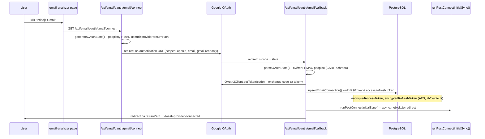
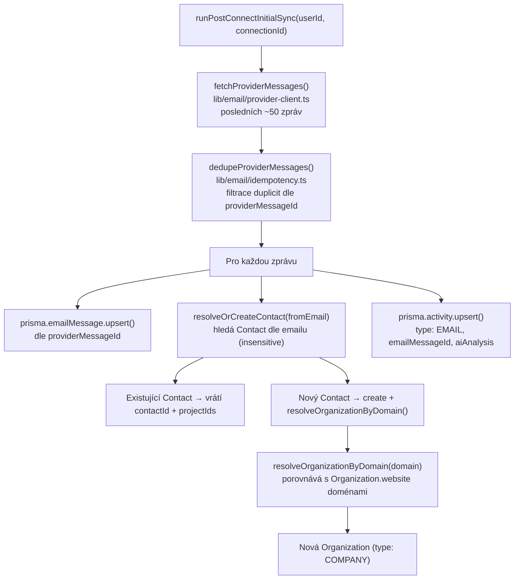
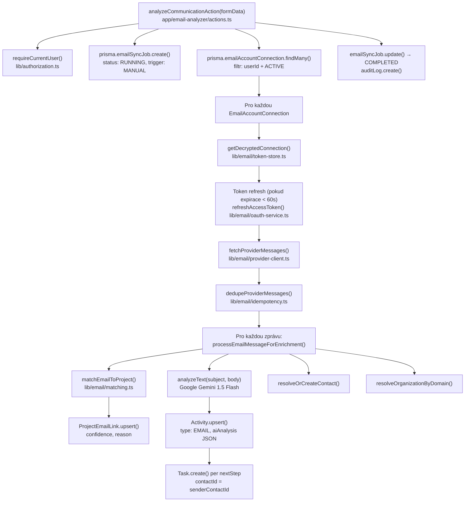
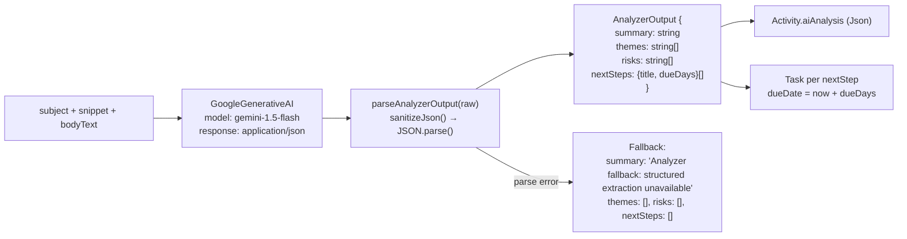
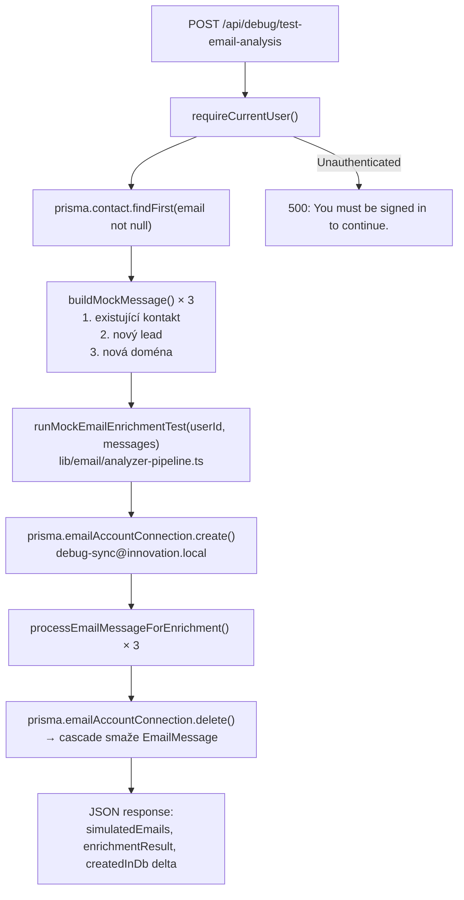
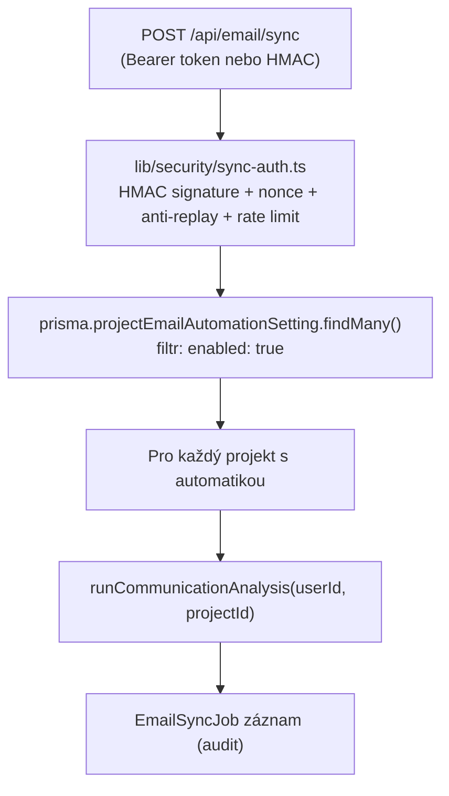

# Email Analyzer Flow – detailní technická mapa

Aktualizováno: 1. 5. 2026
Zdrojové soubory: `lib/email/`, `app/api/email/`, `app/email-analyzer/`

Tento dokument popisuje přesný technický flow. Pro produktový přehled viz [[Email Analyzer]].

---

## 1) OAuth flow: připojení Gmail účtu

**Klíčové soubory:**
- `app/api/email/oauth/[provider]/connect/route.ts`
- `app/api/email/oauth/[provider]/callback/route.ts`
- `lib/email/oauth-service.ts` – token exchange + refresh
- `lib/email/oauth-state.ts` – HMAC state podpis/verifikace
- `lib/email/token-store.ts` – `upsertEmailConnection()`, `getDecryptedConnection()`
- `lib/crypto.ts` – AES šifrování/dešifrování

---

## 2) Initial sync po připojení Gmailu

Soubor: `lib/email/post-connect-sync.ts`

---

## 3) Manuální analýza komunikace

UI: `app/email-analyzer/page.tsx`  
Action: `app/email-analyzer/actions.ts` → `analyzeCommunicationAction()`  
Pipeline: `lib/email/analyzer-pipeline.ts` → `runCommunicationAnalysis()`

---

## 4) Párování e-mailu s projektem

Soubor: `lib/email/matching.ts` → `matchEmailToProject()`

| Reason | Confidence | Podmínka |
|---|---|---|
| `contact_email_exact` | 1.0 | `participants.from[0].email` = email kontaktu projektu |
| `organization_domain` | 0.7 | Doména odesílatele = doména webu organizace kontaktu |
| `keyword_alias` | 0.45 | subject/snippet/body obsahuje název projektu nebo `keywordAliases` |

Výsledek: `{ matched: boolean, confidence: number, reason: string }`

Pokud `matched: true` → `ProjectEmailLink.upsert()` (unique: `projectId_emailMessageId`)

---

## 5) AI analýza textu

Soubor: `lib/email/analyzer-pipeline.ts` → `analyzeText(subject, bodyText)`

**Fallback bez API key:** pokud `GOOGLE_AI_API_KEY` chybí, vrátí se `"Analyzer skipped: GOOGLE_AI_API_KEY is missing."` — ne error, aplikace pokračuje.

---

## 6) Test endpoint (debug)

Soubor: `app/api/debug/test-email-analysis/route.ts`

**Požadavky:** přihlášený Kinde uživatel, DB s tabulkou `Task.contactId` (migrace `20260430231232_task_contact_link`).

---

## 7) Automatický sync (cron endpoint)

Soubor: `app/api/email/sync/route.ts`  
Ochrana: `lib/security/sync-auth.ts`

**Env vars pro cron:** `EMAIL_SYNC_CRON_SECRET` (volitelné Bearer token) nebo HMAC signing.

---

## 8) Side effects a integrity dat

- `resolveOrCreateContact()` může vytvořit nové `Contact` a `Organization` záznamy při každé analýze.
- `prisma.task.create()` s `contactId` → pokud contact byl smazán mezitím, FK je `onDelete: SetNull` → task zůstane, `contactId = null`.
- `runMockEmailEnrichmentTest()` smaže dočasný `EmailAccountConnection` v `finally` bloku → cascade smaže `EmailMessage`, ale ne `Activity` (má `onDelete: SetNull` na `emailMessageId`).
- `EmailSyncJob` zůstane v DB vždy — pro audit log.

---

## 9) Navigace na related poznámky

- [[Email Analyzer]] – produktový přehled + implementační detaily
- [[../06_Data_Model/Data Model]] – datový model Email entit
- [[../09_Security/Security]] – šifrování tokenů, OAuth state, env vars
- [[../11_Implementation/Local Development & DB Reset]] – debug + local setup
- [[../12_System_Memory/System Memory Map]] – celková architektura
