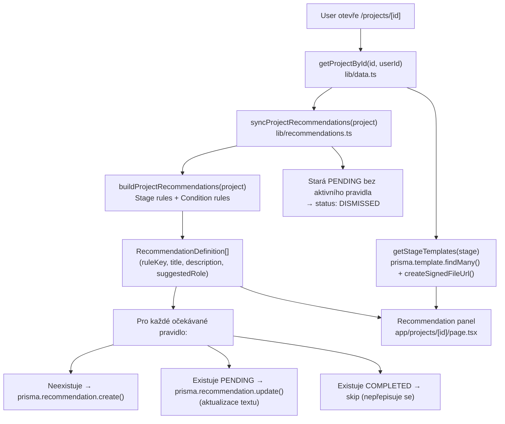
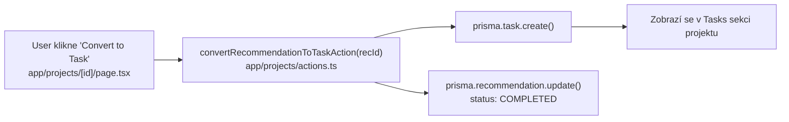

# Recommendation Engine Map

Aktualizováno: 1. 5. 2026
Zdrojový soubor: `lib/recommendations.ts`

Tento dokument popisuje přesnou implementaci. Pro přehled pravidel viz [[Rules]].

---

## Účel

Rule-based engine, který pro každý projekt vyhodnocuje sadu pravidel a generuje `Recommendation` záznamy do DB. UI zobrazuje jen `PENDING` záznamy — ostatní jsou skryté.

---

## Klíčové soubory

| Soubor | Obsah |
|---|---|
| `lib/recommendations.ts` | Celý engine: pravidla, sync, templates |
| `lib/data.ts` | `getProjectById()` — volá `syncProjectRecommendations()` jako side-effect |
| `app/projects/[id]/page.tsx` | Detail projektu — zobrazuje recommendation panel |
| `app/projects/actions.ts` | `convertRecommendationToTaskAction()` — konverze doporučení na task |
| `prisma/schema.prisma` | Model `Recommendation`, `@@unique([projectId, ruleKey])` |

---

## Runtime flow

---

## Pravidla (10 celkem)

### Stage pravidla (2 per fáze = 10 celkem pro 5 fází)

| ruleKey | Stage | Suggested role |
|---|---|---|
| `stage:discovery:market-size` | DISCOVERY | Industry expert |
| `stage:discovery:target-audience` | DISCOVERY | Startup mentor |
| `stage:validation:interviews` | VALIDATION | Startup mentor |
| `stage:validation:mvp-scope` | VALIDATION | Evaluator |
| `stage:mvp:analytics` | MVP | Technical lead |
| `stage:mvp:success-metrics` | MVP | Product lead |
| `stage:scaling:business-development` | SCALING | Business Developer |
| `stage:scaling:investor-readiness` | SCALING | Investor |
| `stage:spin-off:company-roadmap` | SPIN_OFF | Technology transfer officer |
| `stage:spin-off:ip-transfer` | SPIN_OFF | IP lawyer |

### Condition pravidla (přidávají se na základě stavu projektu)

| ruleKey | Trigger |
|---|---|
| `condition:missing-ip-status` | `ipStatus` je null nebo prázdný string |
| `condition:business-capability-gap` | `teamStrength == TECHNICAL_ONLY` nebo `businessReadiness == WEAK` |
| `condition:missing-next-step` | `nextStep` je null nebo prázdný string |
| `condition:stale-contact` | `lastContactAt` je starší než 30 dní |
| `condition:high-potential-support-plan` | `potentialLevel == HIGH` a `stage != SCALING, SPIN_OFF` |

---

## Deduplikace

`@@unique([projectId, ruleKey])` na modelu `Recommendation` — pro každý projekt existuje maximálně jeden záznam per pravidlo.

`syncProjectRecommendations()` nikdy nepřepisuje `COMPLETED` záznamy — uživatelovo potvrzení (převedení na task) je trvalé.

---

## Konverze na Task

---

## Templates napojené na stage

`getStageTemplates(stage)` vrací šablony pro aktuální fázi projektu. Každá šablona dostane podepsanou Supabase URL (`createSignedFileUrl()`). Šablony jsou zobrazeny v recommendation panelu.

Seed vytváří 5 templates (Discovery Brief, Validation Interview Guide, Pilot Success Metrics, Investor Readiness Pack, Spin-off Formation Checklist).

---

## Side effects a coupling

- `getProjectById()` v `lib/data.ts` spouští `syncProjectRecommendations()` jako side-effect při každém načtení detailu. **Architektonické riziko:** read funkce mění DB. Doporučení: přesunout sync do post-action lifecycle.
- Pokud se změní pipeline fáze projektu, stará stage pravidla se automaticky označí jako `DISMISSED` a nová se vytvoří jako `PENDING`.

---

## Open questions

- Je `syncProjectRecommendations()` jako read side-effect akceptovatelné chování v produkci?
- Přidat `priority` nebo `urgencyScore` na `Recommendation` pro lepší UX prioritizace?
- Expert matching: Jak propojit `suggestedRole` s databází expertů?

---

## Navigace

- [[Recommendation Engine Overview]] – přehledový popis
- [[Rules]] – seznam všech pravidel
- [[Recommended Roles]] – role doporučované enginem
- [[Playbooks]] – životní cyklus doporučení
- [[../12_System_Memory/System Memory Map]] – celková architektura
