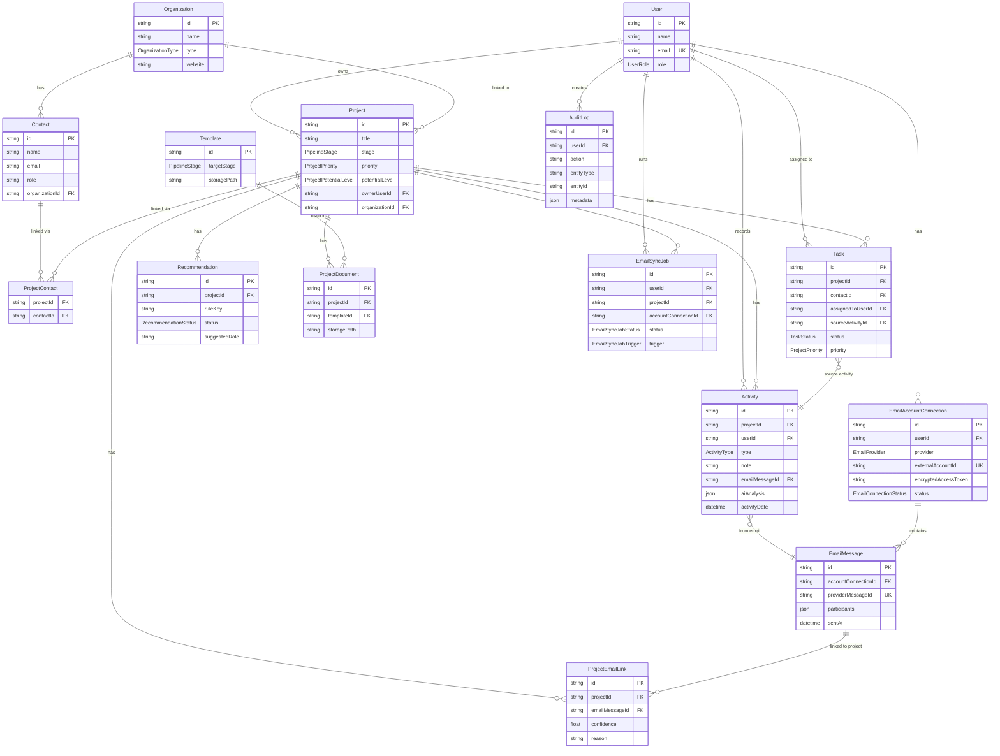

# Data Model

Zdrojová pravda: `prisma/schema.prisma`. Tento dokument je aktuální k dubnu 2026.

## CRM entity

### User
- `id`, `name`, `email` (unique), `role` (UserRole), `createdAt`, `updatedAt`
- Vztahy: `ownedProjects`, `activities`, `assignedTasks`, `emailConnections`, `syncJobs`, `auditLogs`

### Organization
- `id`, `name`, `type` (OrganizationType), `website?`, `notes?`, `createdAt`, `updatedAt`
- Vztahy: `contacts[]`, `projects[]`

### Contact
- `id`, `name`, `email?`, `phone?`, `role`, `organizationId?`, `notes?`, `createdAt`, `updatedAt`
- Vztahy: `organization?`, `projectLinks[]` (M:N), `emailAutomationLinks[]`, `tasks[]`

### Project
- `id`, `title`, `description`, `field?`, `stage`, `priority`, `potentialLevel`, `ipStatus?`
- `teamStrength?`, `businessReadiness?`, `nextStep?`, `nextStepDueDate?`, `lastContactAt?`
- `organizationId?`, `ownerUserId?`, `createdAt`, `updatedAt`
- Vztahy: `organization?`, `owner?`, `contacts[]`, `activities[]`, `tasks[]`, `recommendations[]`, `documents[]`, `emailAutomationSetting?`, `emailLinks[]`, `syncJobs[]`

### ProjectContact (junction)
- `@@id([projectId, contactId])`

### Activity
- `id`, `projectId`, `userId?`, `type` (ActivityType), `note`, `emailMessageId?` (unique), `emailParentId?`, `aiAnalysis?` (Json), `activityDate`, `createdAt`
- Vztahy: `project`, `user?`, `emailMessage?`, `sourceTasks[]`

### Task
- `id`, `projectId`, `contactId?`, `assignedToUserId?`, `sourceActivityId?`, `title`, `description?`
- `status` (TaskStatus), `priority` (ProjectPriority), `dueDate?`, `createdAt`, `updatedAt`
- `contactId?` je volitelná vazba na `Contact` pro Email Analyzer enrichment (tasky z e-mailu jsou navázané na odesílatele).
- `@@index([contactId])`
- `@@index([sourceActivityId])`

### Recommendation
- `id`, `title`, `description`, `ruleKey`, `projectId`, `status` (RecommendationStatus), `suggestedRole`, `createdAt`, `updatedAt`
- `@@unique([projectId, ruleKey])` – jeden záznam per pravidlo per projekt

### Template
- `id`, `name`, `description`, `storagePath` (mapped: `fileUrl`), `targetStage` (PipelineStage), `createdAt`
- Vztahy: `documents[]`

### ProjectDocument
- `id`, `projectId`, `templateId?`, `name`, `storagePath` (mapped: `fileUrl`), `createdAt`
- `@@index([projectId, createdAt])`, `@@index([templateId])`

---

## Email Analyzer entity

### EmailAccountConnection
- `id`, `userId`, `provider` (EmailProvider: GMAIL/OUTLOOK), `emailAddress?`, `externalAccountId`
- `encryptedAccessToken`, `encryptedRefreshToken?`, `tokenExpiresAt?`, `scopes[]`, `status` (EmailConnectionStatus)
- `lastSyncedAt?`, `lastError?`, `createdAt`, `updatedAt`
- `@@unique([provider, externalAccountId])`, `@@index([userId, status])`

### EmailMessage
- `id`, `accountConnectionId`, `provider`, `providerMessageId` (unique), `providerThreadId?`, `providerParentMessageId?`
- `internetMessageId?`, `subject?`, `direction?`, `participants` (Json), `sentAt`
- `snippet?`, `bodyText?`, `bodyHash?`, `hasBody`, `createdAt`, `updatedAt`
- `@@index([accountConnectionId, sentAt])`, `@@index([providerThreadId])`

### ProjectEmailLink
- `id`, `projectId`, `emailMessageId`, `confidence` (Float), `reason`, `createdAt`
- `@@unique([projectId, emailMessageId])`

### EmailSyncCursor
- `id`, `accountConnectionId`, `cursorKey`, `cursorValue`, `updatedAt`
- `@@unique([accountConnectionId, cursorKey])`

### EmailSyncJob
- `id`, `userId`, `projectId?`, `accountConnectionId?`, `trigger` (MANUAL/SCHEDULED)
- `status` (QUEUED/RUNNING/COMPLETED/FAILED), `filterProvider?`, `filterDirection?`, `filterFrom?`, `filterTo?`, `filterContactEmail?`
- `importedEmails`, `matchedContacts`, `suggestedContacts`, `generatedTasks`, `summary?` (Json)
- `startedAt?`, `finishedAt?`, `error?`, `createdAt`, `updatedAt`
- `@@index([userId, createdAt])`, `@@index([projectId, status])`

### ProjectEmailAutomationSetting
- `id`, `projectId` (unique), `enabled`, `schedule?` (DAILY/WEEKLY), `keywordAliases[]`, `createdAt`, `updatedAt`

### ProjectEmailAutomationContact (junction)
- `@@id([settingId, contactId])`

### ProjectEmailAutomationDomain
- `id`, `settingId`, `domain`, `createdAt`
- `@@unique([settingId, domain])`

---

## AuditLog

- `id`, `userId?`, `action`, `entityType`, `entityId?`, `metadata?` (Json), `createdAt`
- `@@index([action, createdAt])`

---

## Enums

| Enum | Hodnoty |
|---|---|
| UserRole | ADMIN, MANAGER, EVALUATOR, USER, VIEWER |
| PipelineStage | DISCOVERY, VALIDATION, MVP, SCALING, SPIN_OFF |
| ProjectPriority | LOW, MEDIUM, HIGH, URGENT |
| ProjectPotentialLevel | LOW, MEDIUM, HIGH |
| ActivityType | MEETING, CALL, EMAIL, NOTE, WORKSHOP, EVALUATION |
| TaskStatus | TODO, IN_PROGRESS, DONE, CANCELLED |
| OrganizationType | UNIVERSITY, FACULTY, RESEARCH_CENTER, INNOVATION_CENTER, COMPANY, INVESTOR, PUBLIC_INSTITUTION |
| TeamStrength | TECHNICAL_ONLY, BALANCED, STRONG |
| BusinessReadiness | WEAK, EMERGING, STRONG |
| RecommendationStatus | PENDING, COMPLETED, DISMISSED |
| EmailProvider | GMAIL, OUTLOOK |
| EmailConnectionStatus | ACTIVE, REVOKED, ERROR |
| SyncSchedule | DAILY, WEEKLY |
| EmailSyncJobStatus | QUEUED, RUNNING, COMPLETED, FAILED |
| EmailSyncJobTrigger | MANUAL, SCHEDULED |

---

## Neimplementováno

Model `Expert` z původního plánu **neexistuje** v schématu.

---

## ER diagram (hlavní entity)

