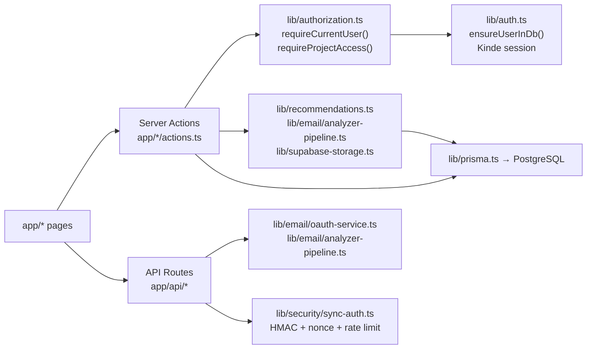
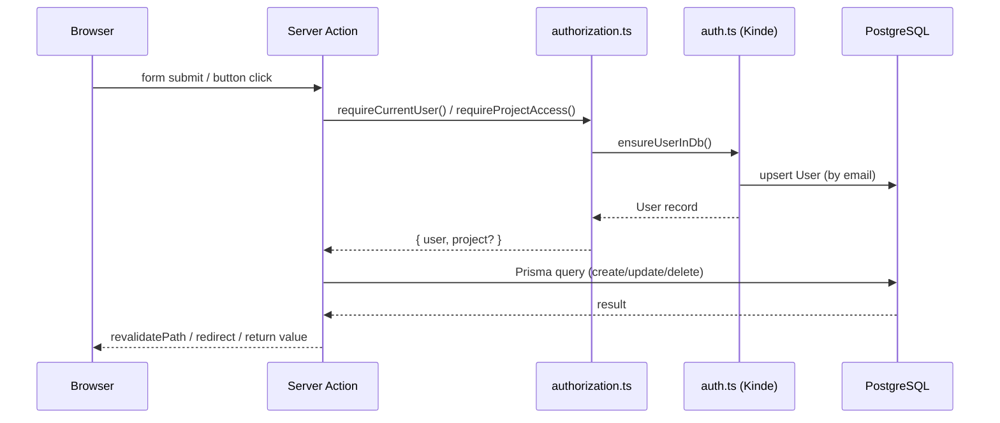
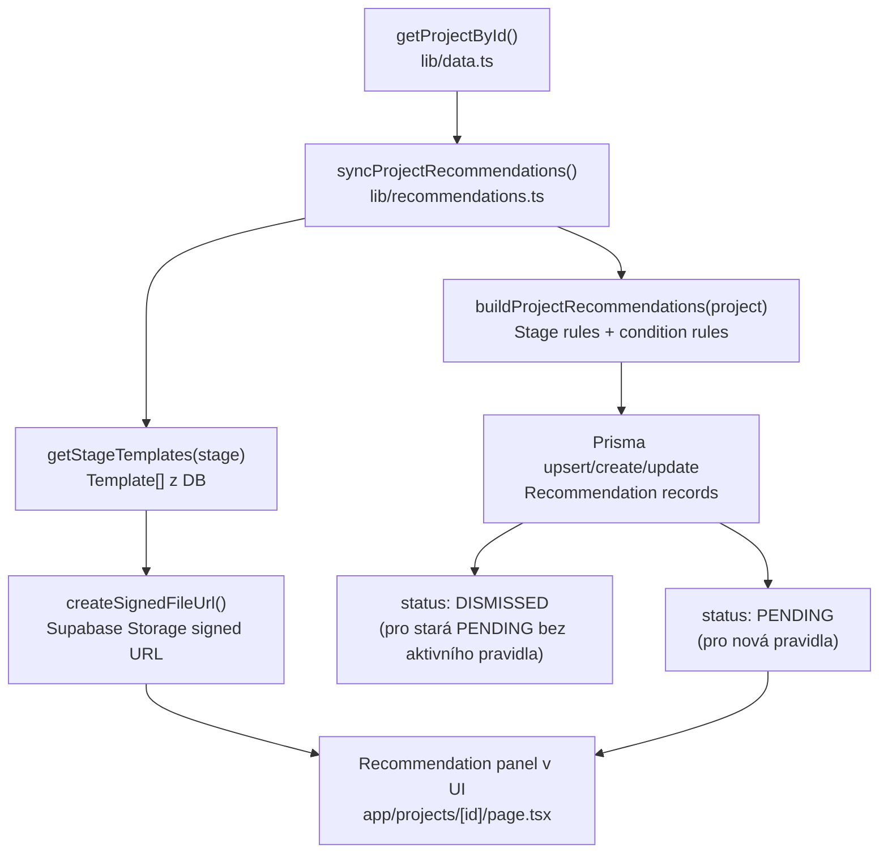

# System Memory Map

Aktualizováno: 1. 5. 2026
Zdroj: aktuální implementace v repozitáři `innovation-evaluation-platform`

## Co je tato poznámka

Jedna centrální technická paměť projektu: co existuje, jak jsou části propojené, kudy tečou data a kde je business logika.

## 1) Snapshot projektu

- Produkt: CRM pro univerzitní/innovation projekty (research -> startup/spin-off)
- Hlavní moduly v MVP:
- Projects
- Contacts
- Organizations
- Activities
- Tasks
- Pipeline
- Rule-based recommendations
- Rozšíření navíc: Email Analyzer (Gmail OAuth + import + AI sumarizace + task návrhy)
- Stack:
- Next.js App Router
- TypeScript
- Tailwind CSS
- Prisma
- PostgreSQL
- Kinde Auth
- Supabase Storage (dokumenty/šablony)

## 2) Struktura kódu (kde co žije)

- `app/`:
- UI stránky + App Router
- Server actions (`app/*/actions.ts`)
- API routes (`app/api/*`)
- `components/`:
- formuláře, dashboard, pipeline, recommendation panel, email UI
- `lib/`:
- business logika (`recommendations.ts`)
- authz/authn (`auth.ts`, `authorization.ts`, `middleware.ts`)
- data access (`data.ts`, `prisma.ts`)
- email pipeline (`lib/email/*`)
- storage (`supabase-storage.ts`)
- `prisma/`:
- schema + migrace + seed
- `docs/obsidian/`:
- produktová dokumentace + tento memory layer

## 3) Datový model a vazby

Primární entity:

- `User` (role-based přístup)
- `Project` (centrální entita)
- `Contact` (M:N na Project přes `ProjectContact`)
- `Organization` (1:N na Project, 1:N na Contact)
- `Activity` (historie práce/komunikace, vč. e-mailových aktivit)
- `Task` (úkoly ručně i automaticky)
- `Recommendation` (stav PENDING/COMPLETED/DISMISSED)
- `Template` + `ProjectDocument` (šablony a dokumenty)

Email Analyzer část:

- `EmailAccountConnection`
- `EmailMessage`
- `ProjectEmailLink`
- `ProjectEmailAutomationSetting`
- `ProjectEmailAutomationContact`
- `ProjectEmailAutomationDomain`
- `EmailSyncJob`
- `AuditLog`

Klíčové enumy:

- `PipelineStage`: DISCOVERY, VALIDATION, MVP, SCALING, SPIN_OFF
- `UserRole`: ADMIN, MANAGER, EVALUATOR, USER, VIEWER
- `TaskStatus`, `ProjectPriority`, `RecommendationStatus`

## 4) Vazby mezi vrstvami (UI -> Action/API -> Service -> DB)

### Runtime flow: typická CRM akce

## 5) CRM flow (core MVP)

### Projects

- List: `/projects` -> `getProjects()`
- Detail: `/projects/[id]` -> `getProjectById()`
- Create: `/projects/new` -> `createProjectAction`
- Edit: `/projects/[id]/edit` -> `updateProjectAction`
- Stage update: `updateProjectStageAction`
- Na detailu projektu se při načtení volá sync doporučení (`syncProjectRecommendations`) a pak se zobrazí jen `PENDING`.

### Contacts

- List + create/edit na `/contacts`
- Detail `/contacts/[id]`
- Access scope podle role a dostupných projektů

### Organizations

- List + create/edit na `/organizations`
- Detail `/organizations/[id]`
- Scope opět podle role/projektů

### Activities

- Na projektu: `createProjectActivityAction`
- Side effect: aktualizuje `project.lastContactAt`

### Tasks

- List `/tasks`, detail `/tasks/[id]`
- Vznikají ručně i konverzí z recommendation
- Konverze: `convertRecommendationToTaskAction` zároveň označí recommendation jako `COMPLETED`

## 6) Recommendation engine (rule-based)

Implementace: `lib/recommendations.ts`

Logika:

- Stage-based baseline pravidla (pro každou pipeline fázi)
- Conditional pravidla:
- chybějící IP status
- slabá business readiness / technical-only tým
- chybějící next step
- stale kontakt >30 dní
- high potential mimo pozdní fáze

Výstup:

- Recommendation objekt + suggested role
- napojení na stage templates (`getStageTemplates`)
- deduplikace přes `ruleKey` a `@@unique(projectId, ruleKey)`

## 7) Email Analyzer flow

### OAuth a připojení

- Connect endpoint: `/api/email/oauth/[provider]/connect` (aktuálně povolen jen Gmail)
- Callback: `/api/email/oauth/[provider]/callback`
- Po callbacku běží `runPostConnectInitialSync(...)` asynchronně

### Analýza komunikace

- UI: `/email-analyzer`
- Action: `analyzeCommunicationAction` -> `runCommunicationAnalysis`
- Pipeline (`lib/email/analyzer-pipeline.ts`):
- fetch zpráv z provideru
- dedupe (`idempotency.ts`)
- match na projekt (`matching.ts`):
- contact email exact
- organization domain
- keyword alias
- AI sumarizace + risk + next steps
- zápis `Activity`, `Task`, linků na projekt/contact

### Automatický sync

- Endpoint: `POST /api/email/sync`
- Ochrana podpisem/HMAC + nonce + anti-replay + rate limit (`lib/security/sync-auth.ts`)
- Iteruje aktivní `ProjectEmailAutomationSetting` a volá `runCommunicationAnalysis`

## 8) Auth a autorizace

- Auth provider: Kinde
- `ensureUserInDb()` mapuje Kinde uživatele do `User` tabulky
- Role mapping: ADMIN / MANAGER / EVALUATOR / fallback VIEWER
- `middleware.ts` hlídá `/projects/*` (token-role based gate)
- Detailní access control je v `lib/authorization.ts`:
- `canAccessAllProjects`: ADMIN, MANAGER
- ostatní obvykle jen vlastní projekty (`ownerUserId`)
- write operace jen pro manage role

## 9) Důležité business coupling body

- `getProjectById()` dělá čtení + side-effect (sync recommendation), tzn. read request může měnit DB.
- Project detail je integrační uzel systému (activities, tasks, docs, recommendations, email links).
- Email Analyzer automaticky zakládá Contacts/Organizations při neznámých odesílatelích (domain inference).

## 10) Seed a demo data

- `prisma/seed.ts` zakládá:
- 2 users
- 3 organizations
- 3 contacts
- 2 projects
- aktivity, tasky, templates, project document
- Seed pokrývá realistický MVP demo scénář pro pipeline + recommendation.

## 11) Co je hotové vs. co je otevřené

Hotové jádro:

- CRM moduly (Projects/Contacts/Organizations/Activities/Tasks)
- Pipeline práce v UI
- Rule-based recommendation engine
- Basic auth + role-ready model
- Template/document flow
- Email Analyzer v2 (Gmail)

Otevřené/next:

- Outlook enablement (model má enum, connect endpoint je zatím Gmail-only)
- hlubší analytics/reporting
- scoring UI
- hardening kolem background sync orchestrace/observability

## 12) Navigace na související Obsidian poznámky

- [[00_Index]]
- [[02_CRM/CRM Overview]]
- [[02_CRM/Email Analyzer]]
- [[05_Recommendation_Engine/Recommendation Engine Overview]]
- [[06_Data_Model/Data Model]]
- [[07_API_Design/API Design]]
- [[09_Security/Security]]
- [[11_Implementation/Implementation Plan]]
