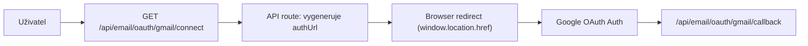

# DEBUG OAuth CORS Fix (Gmail)

Navazuje na: [[02_CRM/Email Analyzer]] · [[09_Security/Security]]

## Incident

Při připojení Gmailu se v browseru objevovala chyba:

- `Preflight response is not successful. Status code: 405`
- `Fetch API cannot load https://accounts.google.com/o/oauth2/v2/auth ... due to access control checks`

## Kde byla chyba

Chyba byla ve flow zahájení OAuth: klientský kód spouštěl OAuth přes `fetch()` workflow místo browser redirectu.

OAuth authorization endpoint (`https://accounts.google.com/o/oauth2/v2/auth`) je určen pro navigaci uživatele (top-level redirect), ne pro XHR/fetch volání z aplikace.

## Proč fetch na OAuth endpoint nefunguje

Browser při cross-origin `fetch` může nejdříve poslat CORS preflight (`OPTIONS`).
Google OAuth authorize endpoint není API endpoint pro CORS XHR scénář, takže preflight neprojde (typicky 405/blocked CORS policy).

Důsledek: OAuth flow se ani nespustí, protože request je blokovaný ještě před navigací uživatele na consent screen.

## Oprava

Upravený flow:

1. Klient zavolá interní route `GET /api/email/oauth/gmail/connect?mode=url&returnPath=/email-analyzer`.
2. Route vygeneruje OAuth URL přes `createProviderAuthUrl(...)`.
3. Route vrátí URL jako plain string (nevolá Google API).
4. Klient provede `window.location.href = authUrl`.
5. Browser přejde na Google auth stránku jako standardní navigace.

Současně route zachovává i redirect variantu (302) při volání bez `mode=url`.

## Změněné soubory

- `components/ConnectGmailButton.tsx`
- `app/email-analyzer/page.tsx`
- `app/api/email/oauth/[provider]/connect/route.ts`

## OAuth tok (po fixu)

